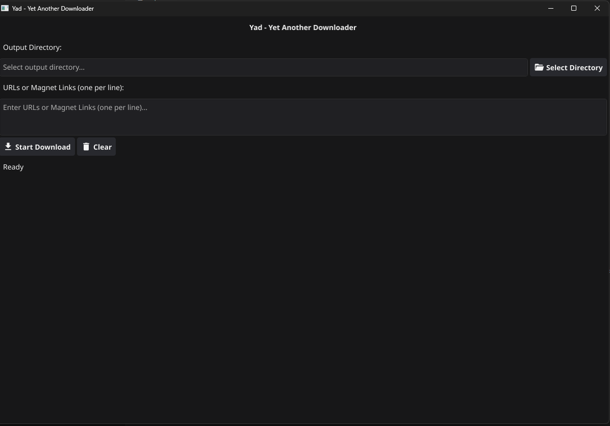
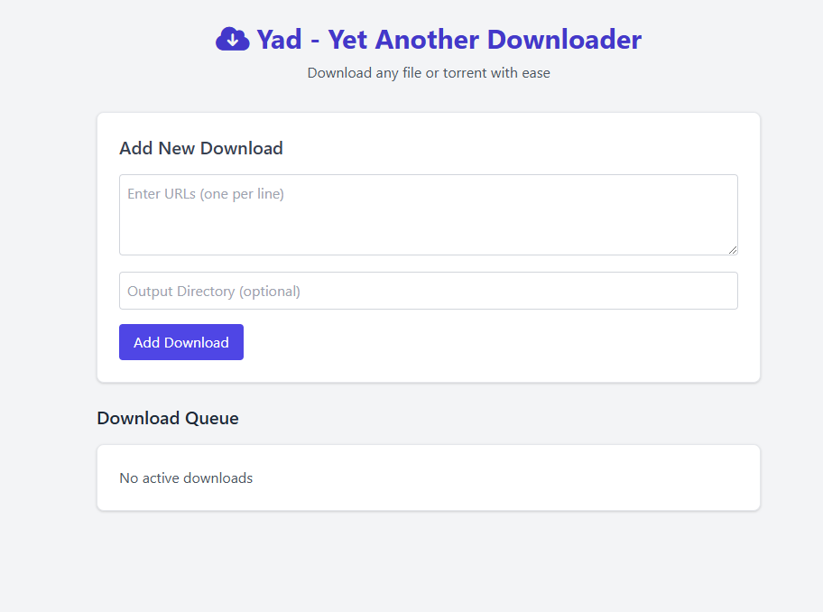

# Yad

A cross-platform desktop application built with Go and Fyne that allows users to download files from HTTP URLs or magnet links. The application provides a simple and intuitive interface for managing downloads, including progress bars for each download.

---

## Features

- **HTTP Downloads**:
  - Download files from HTTP URLs.
  - Progress bars show real-time download progress.
  - Files are saved to a user-selected directory.

- **Torrent Downloads**:
  - Download files from magnet links.
  - Progress bars show real-time torrent download progress.
  - Files are saved to a user-selected directory.

- **User-Friendly Interface**:
  - Select the output directory using a folder picker.
  - Enter multiple URLs or magnet links (one per line).
  - Start and monitor downloads with progress bars.

- **Concurrent Downloads**:
  - Supports multiple concurrent downloads (up to 5 workers).

---

## Installation

> TODO

## Screenshots

### Main UI

### Download UI

## Usage

1. **Select Output Directory**:
   - Click the "Select Directory" button to choose where downloaded files will be saved.

2. **Enter URLs or Magnet Links**:
   - Paste or type URLs or magnet links into the text box, one per line.

3. **Start Download**:
   - Click the "Start Download" button to begin downloading files.
   - Progress bars will appear for each download.

4. **Monitor Progress**:
   - Watch the progress bars to track the download status.
   - Downloaded files will be saved in the selected output directory.

---

## Code Structure

- **`main.go`**:
  - Entry point of the application.
  - Handles UI setup and event handling.

- **`downloadFile` function**:
  - Handles HTTP downloads.
  - Saves files to the output directory and updates the progress bar.

- **`downloadTorrent` function**:
  - Handles magnet link downloads using the `anacrolix/torrent` library.
  - Saves torrent files to the output directory and updates the progress bar.

- **`progressWriter` struct**:
  - Updates the progress bar as data is written during HTTP downloads.

---

## Dependencies

- **[Fyne](https://fyne.io/)**:
  - A cross-platform GUI framework for Go.
  - Used to build the user interface.

- **[Anacrolix Torrent](https://github.com/anacrolix/torrent)**:
  - A Go library for handling torrent downloads.
  - Used to download files from magnet links.

---

## Acknowledgments

- **[Fyne](https://fyne.io/)** for providing an easy-to-use GUI framework.
- **[Anacrolix Torrent](https://github.com/anacrolix/torrent)** for enabling torrent downloads in Go.
